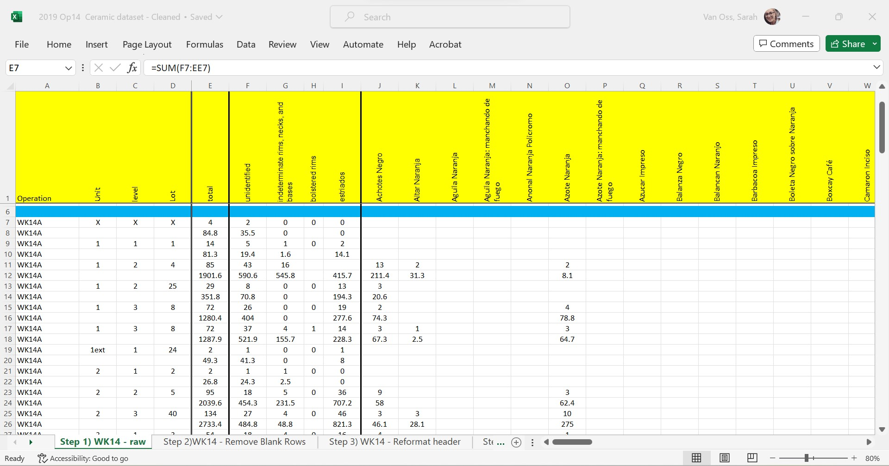

```{r setup, include=FALSE}
knitr::opts_chunk$set(echo = TRUE)
```

### Collecting Data from Ceramic Artifacts

Objective: Clean raw data collected during ceramic analysis to prepare it for analysis and entry into a relational database. Analyzing ceramic artifact distributions and typology differences can give us information on socio-economic status, time period, and economic exchange.

Step 1: Raw Data that includes artifact typologies, counts, and weights by context.



Step 2: Removing blank rows and barriers.


Step 3: Reformat header to take up less space on the page and make header text horizontal.


Step 4: Fill all blanks with 0's.


Step 5: Duplicate contextual information for both counts and weights values.


Step 6: Format contextual information and create context key to coordinate with other database files (column A).


Step 7: Separate the counts and weights for ceramic types to facilitate future statistical analysis by using IFEVEN command to separate out odd (weights) and even (count) rows.


Step 8: Formatting final weights of ceramic artifacts and context information.


Step 9: Formatting final counts of ceramic artifacts and context information.


